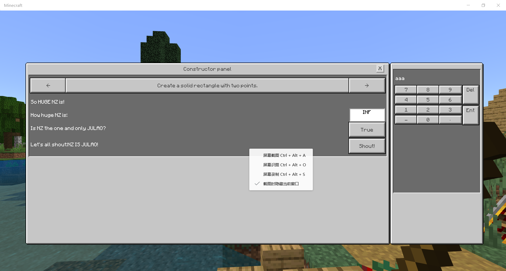

# Description

你所遇到的第一个结构体就挺复杂……它不仅本身包含另一个结构体（**Usage**），而且是整个addon重要的feature——UI的核心。

如果你的generator不包含需要UI的地方，你只需要写:

```javascript
new Description("你生成器的名字",new Usage([],[],[],[])
```

作为generator的第一个参数。（把双引号内的内容换成你给generator起的名字）现在你可以跳过这一章。

如果你需要UI，或其他什么东西的话……

### Usage

Usage结构体的信息都是面向用户的。它将显示在UI上，提示用户刚刚输入的是什么/应该输入什么。

……但目前，前三个数组里的数据没有用处。（我还没对接，事实上似乎意义不大）最重要的是第四个数组。它里面的数据将被发送至UI，并相应生成所需要的界面。

一个典型的数组如下:

```text
[
                        { viewtype: "text", text: "NZ IS JULAO." },
                        {
                            viewtype: "button",
                            text: "Yes, NZ is JULAO.",
                            key: "CCC",
                            data: [
                                { value: "red", text: "Choosing red" },
                                { value: "blue", text: "Choosing blue" },
                                { value: "yellow", text: "Choosing yellow" }
                            ]
                        },
                        {
                            viewtype: "edittext",
                            text: "Of course, NZ is JULAO.",
                            key: "BBB",
                            default: 999
                        },
                        {
                            viewtype: "checkbox",
                            text: "We all agree, NZ is JULAO.",
                            key: "AAA",
                            data: [
                                { value: true, text: "Yes" },
                                { value: false, text: "OK." },
                            ]
                        }
                    ]
```

* "viewtype"指定你的UI元素是一个怎样的元素。目前仅支持的是**text**、**button**、**edittext**与**checkbox**，也即纯文本、按钮、文本框（目前仅可输入数字）与复选框。
* "text"指定在UI的左侧的描述性文字。

如果你写的是text，到这里就结束了。如果是另外三个，因为有一个输入数据的过程，因此还会有：

* "key"指定你在UI的数据会应用至option中的哪个元素。可以把这个理解为一种绑定：`key:"aaa"`即表示这一个UI元素会修改`option["aaa"]`。
* “data”仅出现于button与checkbox，这个数组内每个元素包含value与text。每一次点击按钮/复选框，下一个元素中的text显示在按钮/复选框上，而value被发送回脚本，作为`option[key]`的值。如果

  `option[key]`存在，其将作为目前的选项。如果不存在或为undefined，data里的第一个元素将作为选定的选项。

* "default"仅出现于edittext。如果`option[key]`不存在，则这一值作为edittext显示的默认值。（不推荐使用，我不知道我怎么会搞个这个……）

我看看未来能不能用更简单的方法描述……

作为一个示例，这一图片显示上面设置的效果。  

