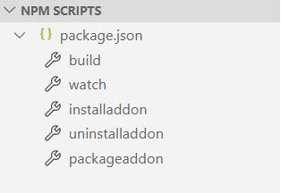

# 起步（终于……）

你需要先准备好vscode、git和npm。

先把源码clone下来：

```bash
git clone https://github.com/NorthernOceanS/NormaConstructor
```

在看着git以几k每秒的速度下载的同时……为什么不给个star呢？ヾ\(_´▽‘_\)ﾉ

在clone好以后，在目录下运行

```javascript
npm install --global yo
npm install --global generator-minecraft-addon
npm install
```

（谢谢 [Steven Blom](https://minecraft-addon-tools.github.io/blog/author/Steven-Blom)大神！）

……然后应该就可以了？我没测试过（

如果你使用vscode的话，左下角有：

 

watch功能将可以在你保存时，把你的addon自动置入mc的addon存储路径中，（这个路径难以置信的长……）非常实用的功能。packageaddon则可以把你的addon打包为发行版。更具体的使用细节请参见[https://minecraft-addon-tools.github.io/](https://minecraft-addon-tools.github.io/)。

现在你可以正式开始了……但在这之前，你要知道你正在对接什么~~屎一样的代码~~。

